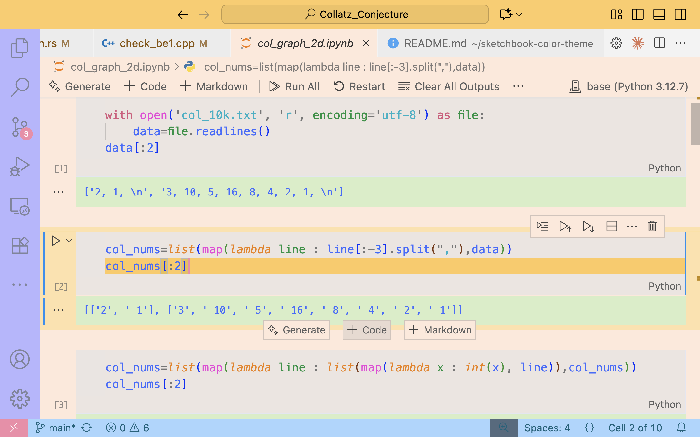

# 🖼️ Sketchbook Color Theme

Bring back the joy of a child’s sketchbook 🎨 
A lighthearted pastel VSCode theme with **simple colors, bold contrasts, and a touch of nostalgia.**

---

## 📷 Screenshots

---

## 🚀 Installation

1. Open **Extensions Marketplace** in VSCode  
2. Search for `Sketchbook Color Theme`  
3. Click **Install** and select the theme from the Command Palette.
